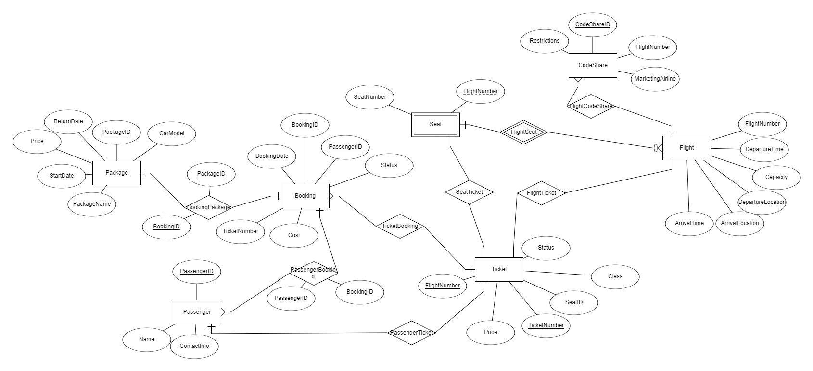
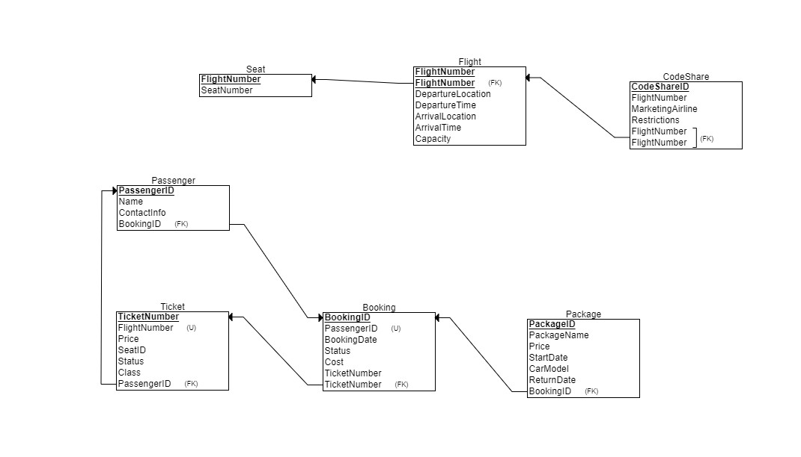

# AirlineDB
Fake Airline Database for Database Project 

To Create the tables and populate them, run the files in the following order:

1. First, run the **Enums.sql** script to create enums on local system
2. The Schema definition: **Tables.sql** and **Relations.sql**
3. For generating random data, run the scripts in Data Generation folder in the following order:
   * TicketGen.py
   * FlightGen.py
   * SeatGen.py
   * PassengerGen.py
   * BookingGen.py
   * PackageGen.py
   * CodeShareGen.py
   * Relations.py

  
Below is a screenshot of the ERD:

Below is a screenshot of the DSD:

