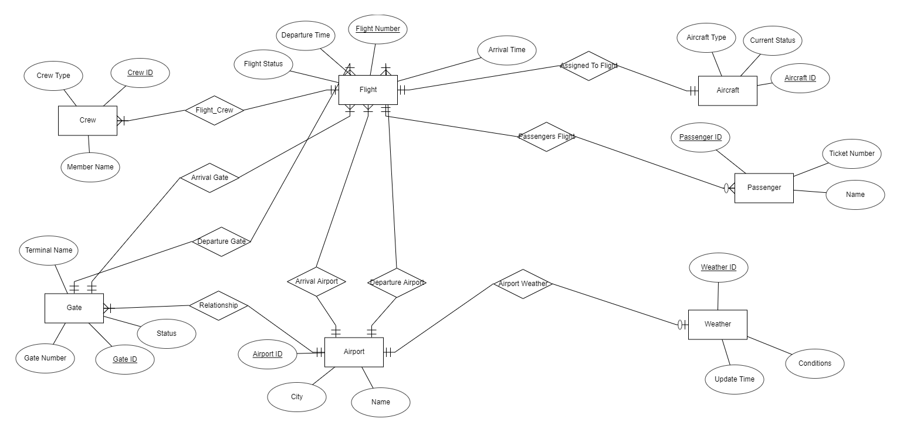
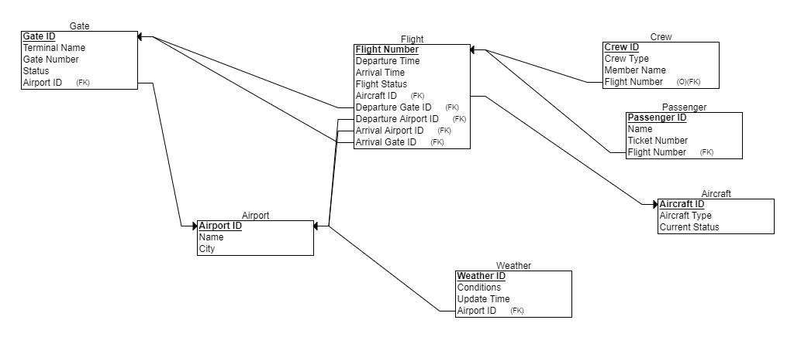

# Airline Database - Ticketing Service
Fake Airline Database for Database Project. 

As a class, we decided to create a database for an airline company. Each group has taken a different part of the database.
We took the booking and tickets part where passenger's (customer's) bookings are managed in the database. 
In addition to flights, we offer package deals where customer's can rent cars through our service.

### Creating the Database
To Create the tables and populate them, run the files in the following order:

1. First, run the **Enums.sql** script to create enums on local system
2. The Schema definition: **Tables.sql**
3. For generating random data, run the scripts in Data Generation folder in the following order:
   * TicketGen.py 
   * FlightGen.py
   * SeatGen.py
   * PassengerGen.py
   * BookingGen.py
   * PackageGen.py
   * CodeShareGen.py

In ticket generator, we generate passenger IDs randomly, as well as generating the seats using a random number generator and getting a letter from A-K (not I). We set the status of a seat to Standby if there are too many seats on any given flight.

In the flight generator, we generate locations from a long list of cities, generate random departure date, and the arrival date is either the same date, or the next day and capacity will either be 120 for a small plane or 484 for a large plane.

In the Seat generator, the seats are read from the existing tickets and the flight number from the tickets.csv.

Passenger names and phone numbers are generated using Faker (a python library) and the passenger IDs are read from tickets.csv file.

Bookings are generated using the ticket and flight csv files to fill the details of a booking and random generators for the other fields (status and cost)

Packages are generated using the ticket, flight and booking files so that the car rental matches up with flight dates, list of a number of car models are stored in different lists and randomly chosen from based on randomly chosen package name.

Codeshares are generated based on flights from the flights.csv file, a restrictions list which restrictions are randomly chosen from (including no resrictions as an option), and a randomly generated airline.

To copy the data into the database, use the following copy commands. **Ensure to change the directory locations to ensure the copy commands will work correctly.**
```
psql -d AirlineDB -c "\copy Passenger (PassengerID, Name, ContactInfo) FROM 'C:\dev\python\AirlineDB script\passengers.csv' CSV HEADER;"
```
```
psql -d AirlineDB -c "\copy Seat (FlightNumber, SeatNumber) FROM 'C:\dev\python\AirlineDB script\seats.csv' CSV HEADER;"
```
```
psql -d AirlineDB -c "\copy Ticket (TicketNumber, FlightNumber, SeatNumber, Price, Status, Class, PassengerID) FROM 'C:\dev\python\AirlineDB script\tickets.csv' CSV HEADER;"
```
```
psql -d AirlineDB -c "\copy Booking (BookingID, PassengerID, BookingDate, Status, Cost, TicketNumber) FROM 'C:\dev\python\AirlineDB script\bookings.csv' CSV HEADER;"
```
```
psql -d AirlineDB -c "\copy Package (PackageID, PackageName, Price, StartDate, CarModel, ReturnDate) FROM 'C:\dev\python\AirlineDB script\packages.csv' CSV HEADER;"
```
```
psql -d AirlineDB -c "\copy CodeShare (CodeShareID, FlightNumber, MarketingAirline, Restrictions) FROM 'C:\dev\python\AirlineDB script\codeshares.csv' CSV HEADER;"
```

Below is a screenshot of the ERD:


Below is a screenshot of the DSD:


The enums in the database are:

**ticket_class:** 'Economy', 'EconPlus', 'Business', 'First'

**ticket_status:** 'Booked', 'Cancelled', 'CheckedIn', 'Boarded', 'InFlight', 'Landed', 'NoShow'

**booking_status:** 'Confirmed', 'Cancelled', 'Pending', 'Complete'

We will be managing the ticketing part of the airline database. We have seven entities as
follows:
1. **Ticket** : Contains details about the ticket, the passenger, the flight and other details.
2. **Passenger** : Details about the passenger.
3. **Flight** : Details about the flight, departure and arrival times and locations.
4. **Booking** : Details about a customer’s booking, date of the booking.
5. **Rental Package** : Details of car rental if a customer wants to add on to their booking.
6. **CodeShare** : Information about code-share agreements between us and other airlines,
    flight numbers and other details.
7. **Seat** : Represents seats on flights. This is a weak entity as it is completely dependent on
    Flights.


Properties of the entities are as follows:
1. **Ticket** : TicketNumber, SeatNumber, Class, Status, Price
2. **Passenger** : PassengerID, Name, ContactInfo
3. **Flight** : FlightNumber, DepartureLocation, DepartureTime, ArrivalLocation, ArrivalTime,
    Capacity
4. **Booking** : BookingID, TicketNumber, PassengerID, BookingDate, Status
5. **Rental Package** : PackageID, Package Name, BookingID, StartDate, ReturnDate,
    CarModel, Price
6. **CodeShare** : CodeShareID, FlightNumber, MarketingAirline, Restrictions
7. **Seat** : FlightNumber, SeatNumber

**Backup Command with DROP, CREATE and INSERTS:**

Run the following command in command line and input “postgres” user password:
```
pg_dump --file "backupPSQL.sql" --username "postgres" --format=c --large-objects --
inserts --rows-per-insert "1000" --create --clean --if-exists --verbose "AirlineDB" >
backupPSQL.log 2>&
```

**Restore Command:**

To restore, run the following command in command line and input “postgres” user password:
```
pg_restore --username "postgres" --dbname "AirlineDB" --clean --if-exists --disable-
triggers --verbose "backupPSQL.sql" > restorePSQL.log 2>&
```
**Backup Command:**

Run the following command in command line and input “postgres” user password:
```
pg_dump --file "backupSQL.sql" --host "localhost" --port "5432" --username "postgres" --
format=c --large-objects --verbose "AirlineDB" > backupSQL.log 2>&
```

**Restore Command:**

To restore, run the following command in command line and input “postgres” user password:
```
pg_restore --host "localhost" --port "5432" --username "postgres" --dbname "AirlineDB" --
clean --if-exists --disable-triggers --verbose "backupSQL.sql" > restoreSQL.log 2>&
```

**Queries**

**Select Queries:**

1. List all flights departing from 'New York, USA' along with the number of available seats.
```
SELECT f.FlightNumber, f.DepartureLocation, f.ArrivalLocation, f.DepartureTime, f.ArrivalTime, f.Capacity - COUNT(t.TicketNumber) AS AvailableSeats
FROM Flight f
LEFT JOIN Ticket t ON f.FlightNumber = t.FlightNumber
WHERE f.DepartureLocation = 'New York, USA'
GROUP BY f.FlightNumber;
```
2. Calculate the average price of tickets in 'Business' class for each flight
```
SELECT FlightNumber, AVG(Price) AS AvgBusinessPrice
FROM Ticket
WHERE Class = 'Business'
GROUP BY FlightNumber
ORDER BY AvgBusinessPrice DESC;
```
3. Retrieve the contact information for passengers who have booked a flight to 'London,
    UK'
```
SELECT p.Name, p.ContactInfo
FROM Passenger p
JOIN Booking b ON p.PassengerID = b.PassengerID
JOIN Ticket t ON b.TicketNumber = t.TicketNumber
JOIN Flight f ON t.FlightNumber = f.FlightNumber
WHERE f.ArrivalLocation = 'London, UK';
```
4. Sum the total cost of bookings for each passenger who has bookings in the 'Complete'
    status
```
SELECT p.PassengerID, p.Name, SUM(b.Cost) AS TotalCost
FROM Passenger p
JOIN Booking b ON p.PassengerID = b.PassengerID
WHERE b.Status = 'Complete'
GROUP BY p.PassengerID
ORDER BY TotalCost DESC;
```


**Deletes:**

5. Delete all bookings with status 'Cancelled' and return the count of deleted rows
```
WITH DeletedBookings AS (
    DELETE FROM Booking
    WHERE Status = 'Cancelled'
    RETURNING *
)
SELECT COUNT(*) AS DeletedRows FROM DeletedBookings;
```

6. Delete all packages where the car model was 'Chevrolet Corvette' and the car was returned 100 or more days before current date.
```
DELETE FROM Package 
WHERE CarModel = 'Chevrolet Corvette' 
  AND ReturnDate < CURRENT_DATE - INTERVAL '100 days';
```

**Updates:**

7. Update the status of tickets to 'CheckedIn' for a flight departing on a specific date
```
UPDATE Ticket
SET Status = 'CheckedIn'
WHERE FlightNumber IN (
    SELECT FlightNumber
    FROM Flight
    WHERE DepartureTime::date = '2024-07-01'
);

```
8. Update the seat number for a specific ticket and ensure the seat is not already taken
```
UPDATE Ticket
SET SeatNumber = '12A'
WHERE TicketNumber = 1
AND EXISTS (
    SELECT 1
    FROM Seat
    WHERE FlightNumber = (SELECT FlightNumber FROM Ticket WHERE TicketNumber = 1)
    AND SeatNumber = '12A'
)
AND NOT EXISTS (
    SELECT 1
    FROM Ticket
    WHERE FlightNumber = (SELECT FlightNumber FROM Ticket WHERE TicketNumber = 1)
    AND SeatNumber = '12A');
```


**Parameterized Queries:**

9. Find flights departing on a specific date with available seats
```
PREPARE available_flights_by_date (DATE) AS
SELECT f.FlightNumber, f.DepartureLocation, f.ArrivalLocation, f.DepartureTime, f.ArrivalTime, f.Capacity - COUNT(t.TicketNumber) AS AvailableSeats
FROM Flight f
LEFT JOIN Ticket t ON f.FlightNumber = t.FlightNumber
WHERE f.DepartureTime::date = $1
GROUP BY f.FlightNumber
HAVING f.Capacity - COUNT(t.TicketNumber) > 0;
```
```
EXECUTE available_flights_by_date('2024-07-01');
```
10. Update ticket status based on user input and ensure the ticket exists
```
PREPARE update_ticket_status (ticket_status, int) AS
UPDATE Ticket
SET Status = $1
WHERE TicketNumber = $2
AND EXISTS (
    SELECT 1
    FROM Ticket
    WHERE TicketNumber = $2
);
```
```
EXECUTE update_ticket_status('Booked', 1234);
```
11. Delete bookings for a given passenger and return the count of deleted rows
```
PREPARE delete_bookings_and_count (int) AS
WITH DeletedBookings AS (
    DELETE FROM Booking
    WHERE PassengerID = $1
    RETURNING *
)
SELECT COUNT(*) AS DeletedRows FROM DeletedBookings;
```
```
EXECUTE delete_bookings_and_count(123);
```
12. Calculate the total cost of bookings within a date range for a specific passenger
```
PREPARE total_cost_by_passenger_and_date_range (int, date, date) AS
SELECT PassengerID, SUM(Cost) AS TotalCost
FROM Booking
WHERE PassengerID = $1
AND BookingDate BETWEEN $2 AND $3
GROUP BY PassengerID;
```
```
EXECUTE total_cost_by_passenger_and_date_range(123, '2023-01-01', '2023-12-31');
```

The actual queries can be found in [Queries](queries.sql) (1-8) and [Paramaterised Queries](ParamQueries.sql) (9-12) files.
The detailed timings for the [Queries](QueriesTiming.log) and [Parameterised Queries](ParamQueriesTiming.log).

Before indexing, the timing was as follows:


| Query | Preparation Time (ms) | Execution Time (ms) |
|-------|-----------------------|---------------------|
| 1     | 2.256                 | 31.855              |
| 2     | 0.379                 | 28.704              |
| 3     | 21.932                | 198.084             |
| 4     | 0.427                 | 81.574              |
| 5     | 1.705                 | 14.958              |
| 6     | 1.506                 | 3.706               |
| 7     | 0.551                 | 36.417              |
| 8     | 0.244                 | 0.073               |

For the Parameterised Queries:

| Query | Preparation Time (ms) | Execution Time (ms) |
|-------|-----------------------|---------------------|
| 9     | 0.524                 | 27.887              |
| 10    | 0.264                 | 0.156               |
| 11    | 0.235                 | 12.577              |
| 12    | 0.211                 | 45.154              |

# Indexes

We made the following indexes:

**Booking Table:**

Passengerid, status

Passengerid, cost

**Flight Table:**
ArrivalLocation

DepartureLocation

**Ticket Table:**

FlightNumber

Class, FlightNumber

FlightNumber, status

After indexing, the timing was as follows:
| Query | Preparation Time (ms) | Execution Time (ms) | Indexes Used                  |
|-------|-----------------------|---------------------|-------------------------------|
| 1     | 9.152                 | 36.779              | idx_flight_departurelocation  |
| 2     | 0.274                 | 22.100              | idx_ticket_class_flightnumber |
| 3     | 16.124                | 74.296              | idx_flight_arrivallocation    |
| 4     | 9.808                 | 49.451              |                               |
| 5     | 0.118                 | 7.690               | idx_booking_passenger_status  |
| 6     | 0.074                 | 3.157               |                               |
| 7     | 7.625                 | 5.427               | idx_ticket_flightnumber_status|
| 8     | 0.419                 | 0.152               | idx_ticket_flightnumber_status|


Comparing the execution times before and after indexing:

| Query | Execution Time (ms) Before Indexing | Execution Time (ms) After Indexing |
|-------|-------------------------------------|------------------------------------|
| 1     | 31.855                              | 36.779                             |
| 2     | 28.704                              | 22.100                             |
| 3     | 198.084                             | 74.296                             |
| 4     | 81.574                              | 49.451                             |
| 5     | 14.958                              | 7.690                              |
| 6     | 3.706                               | 3.157                              |
| 7     | 36.417                              | 5.427                              |
| 8     | 0.073                               | 0.152                              |


# Constraints:

Checking Constraints:


```
INSERT INTO SEAT VALUES(123, '19T');
```

**ERROR** : new row for relation "seat" violates check constraint "chk_seat_number"

**DETAIL** : Failing row contains (123, 19T).

**Explanation:** The constraint checks that the Seat is a possible seat which is checked using a
regular expression. A seat is any two digit number followed by any of the letters A-K, excluding I.


.

```
INSERT INTO Ticket (FlightNumber, SeatNumber, Price, Status, Class, PassengerID)
VALUES (1, '12A', -100, 'Booked', 'Economy', 1);
```
**ERROR:** new row for relation "ticket" violates check constraint "chk_price"

**DETAIL:** Failing row contains (3, 1, 12A, -100, Booked, Economy, 1).

**Explanation:** The constraint checks that price is greater than zero. The error above occurred
due to inputting -100 as the price.


```
DELETE FROM Seat WHERE SeatNumber LIKE '%E';
```
**ERROR:** update or delete on table "seat" violates foreign key constraint
"ticket_flightnumber_seatnumber_fkey" on table "ticket"

**DETAIL:** Key (flightnumber, seatnumber)=(484, 12E) is still referenced from table "ticket".

**Explanataion:** The delete doesn’t work due to the seat number being referenced to from the
Ticket table.


```
INSERT INTO booking(PassengerID, BookingDate, status, cost, ticketnumber) VALUES
(128, '12- 12 - 2024', 'Pending', -999.50, 43);
```

**ERROR:** New row for relation "booking" violates check constraint "chk_price"

**DETAIL:** Failing row contains (1, 128, 2024- 12 - 12, Pending, -999.5, 43).

**Explanation:** The constraint ensures that the cost field is positive, the attempted input had a
negative cost so an error was thrown.

```
INSERT INTO Flight (DepartureLocation, ArrivalLocation, DepartureTime, ArrivalTime, Capacity) VALUES ('New York', 'Perth’ , '2024-07-01 08:00:00', '2024-07-02 05:00:00', 250);
```
**ERROR:**  new row for relation "flight" violates check constraint "chk_flight_duration"

**DETAIL:**  Failing row contains (11, New York, Perth, 2024-07-01 08:00:00, 2024-07-02 05:00:00, 250).

**Explanation:** The constraint throws an error as after doing some research, the longest flight a plane can perform is 19 hours.

**Stage 3 Queries:**

**Query 1:** List of all passengers along with their flight details
```
SELECT P.PassengerID, P.Name, F.FlightNumber, F.DepartureLocation, F.ArrivalLocation
FROM Booking B
JOIN Passenger P ON B.PassengerID = P.PassengerID
JOIN Ticket T ON B.TicketNumber = T.TicketNumber
JOIN Flight F ON T.FlightNumber = F.FlightNumber;
```

***Query 2:*** List of all bookings with flight details (excluding package details due to schema
constraints)
The reason package details couldn’t be displayed is due to the way bookings and packages are
related in the database schema.
```
SELECT B.BookingID, B.BookingDate, F.FlightNumber, F.DepartureLocation, F.ArrivalLocation
FROM Booking B
JOIN Ticket T ON B.TicketNumber = T.TicketNumber
JOIN Flight F ON T.FlightNumber = F.FlightNumber;
```
***Query 3:*** List all seats that are booked on each flight.
```
SELECT S.FlightNumber, S.SeatNumber
FROM Seat S
JOIN Ticket T ON S.FlightNumber = T.FlightNumber AND S.SeatNumber = T.SeatNumber
WHERE T.Status = 'Booked';
```

The detailed log of the query runtimes can be seen [here](Stage3QueriesTiming.log).

Query timing for the stage 3 queries:

| Query | Execution Time (ms) |
|-------|---------------------|
| 1     | 153.781             |
| 2     | 165.331             |
| 3     | 98.806              |

****Views****

Views provide a way to present data in a structured manner without storing the data physically.
They are defined by SQL queries and can simplify complex data retrieval.

We created the following views:

1. Passenger View
This view will include passenger details along with their booking information. This will be used
by airport security as well as airport desk staff to ensure the passenger is who they say they are
as well as to ensure the passenger gets the correct seat on the flight. It could also be used by
the marketing team to send personalized advertisements based on previous bookings made by
the passenger and promotions to "premium" customers (those that have booked business or
first class tickets before).

```
CREATE VIEW PassengerView AS

SELECT

p.PassengerID,

p.Name,

p.ContactInfo,

b.BookingID,

b.BookingDate,

b.Status AS BookingStatus,

b.Cost,

t.TicketNumber,

t.FlightNumber,

t.SeatNumber,

t.Price AS TicketPrice,

t.Status AS TicketStatus,

t.Class AS TicketClass

FROM

Passenger p

LEFT JOIN

Booking b ON p.PassengerID = b.PassengerID

LEFT JOIN

Ticket t ON b.TicketNumber = t.TicketNumber;
```

Here are a select, insert, delete and update query for the passenger view:
SELECT Query:
```
SELECT * FROM PassengerView WHERE PassengerID = 948576043 OR PassengerID = 949766213;
```
INSERT Query:
```
INSERT INTO Passenger (PassengerID, Name, ContactInfo) VALUES (949766213, 'Jane Doe', '0584468238');
```
UPDATE Query:
```
UPDATE Passenger SET ContactInfo = '0521234588' WHERE PassengerID = 949766213;
```
DELETE Query:
```
DELETE FROM Passenger WHERE PassengerID = 949766213;
```

2. Booking View
This view will include booking details along with flight and passenger information. This will be
used by the airport desk crew when checking in passengers to help see which seats are
available on the passenger's flight and will be able to see if seats are available in the event the
passenger did not book beforehand.

```
CREATE VIEW BookingView AS

SELECT

b.BookingID,

b.PassengerID,

p.Name AS PassengerName,

p.ContactInfo,

b.BookingDate,

b.Status AS BookingStatus,

b.Cost,

t.TicketNumber,

t.FlightNumber,

f.DepartureLocation,

f.ArrivalLocation,

f.DepartureTime,

f.ArrivalTime,

t.SeatNumber,

t.Price AS TicketPrice,

t.Status AS TicketStatus,

t.Class AS TicketClass

FROM

Booking b

LEFT JOIN

Passenger p ON b.PassengerID = p.PassengerID

LEFT JOIN

Ticket t ON b.TicketNumber = t.TicketNumber

LEFT JOIN

Flight f ON t.FlightNumber = f.FlightNumber;
```

Here are a select, insert, delete and update query for the booking view:
SELECT Query:
```
SELECT * FROM BookingView WHERE BookingID > 190050 AND BookingID <= 200001;
```
INSERT Query:
```
INSERT INTO Booking (BookingID, PassengerID, BookingDate, Status, Cost, TicketNumber) VALUES (200002, 948576043, '2023-07-09', 'Completed', 500.00, 2152);
```
UPDATE Query:
```
UPDATE Booking SET Status = 'Cancelled' WHERE BookingID = 200001;
```
DELETE Query:
```
DELETE FROM Booking WHERE BookingID = 200000;
```

3. Flight View
This view will include flight details along with ticket and seat information. This will be used by
the flight admin crew that ensures there are not too many flights at any given time, as well as by
the financial team to ensure flights are relatively fully booked to ensure that the airline's money
is not being wasted on empty flights.

```
CREATE VIEW FlightView AS

SELECT

f.FlightNumber,

f.DepartureLocation,

f.ArrivalLocation,

f.DepartureTime,

f.ArrivalTime,

f.Capacity,

t.TicketNumber,

t.SeatNumber,

t.Price AS TicketPrice,

t.Status AS TicketStatus,

t.Class AS TicketClass,

s.SeatNumber AS AvailableSeat

FROM

Flight f

LEFT JOIN

Ticket t ON f.FlightNumber = t.FlightNumber

LEFT JOIN

Seat s ON f.FlightNumber = s.FlightNumber;
```

Here are a select, insert, delete and update query for the flight view:
SELECT Query:
```
SELECT * FROM FlightView WHERE FlightNumber = 953;
```
INSERT Query:
```
INSERT INTO Flight (DepartureLocation, ArrivalLocation, DepartureTime, ArrivalTime, Capacity) VALUES ('New York, USA', 'Los Angeles, USA', '2024-07-09 08:00:00', '2024-07-09 12:00:00', 120);
```
UPDATE Query:
```
UPDATE Flight SET Capacity = 484 WHERE FlightNumber = 1004;
```
DELETE Query:
```
DELETE FROM Flight WHERE FlightNumber = 1004;
```

4. Package View
This view will include package details. This will be used by the car rental admin staff to manage
which cars have been rented out, are available to be rented and need to be returned/are now
being returned.
```
CREATE VIEW PackageView AS

SELECT

PackageID,

PackageName,

Price,

StartDate,

CarModel,

ReturnDate

FROM

Package;
```

Here are a select, insert, delete and update query for the package view:
SELECT Query:
```
SELECT * FROM PackageView WHERE PackageID = 105;
```
INSERT Query:
```
INSERT INTO Package (PackageName, Price, StartDate, CarModel, ReturnDate) VALUES ('Premium', 2958.34, '2023-07-15', 'Savana 1500', '2024-07-20');
```
UPDATE Query:
```
UPDATE Package SET Price = 1650.00 WHERE CarModel = 'Savana 1500';
```
DELETE Query:
```
DELETE FROM Package WHERE PackageID = 2586;
```


****Visualizations****

***Number of bookings per flight***

```
SELECT F.FlightNumber, COUNT(B.BookingID) AS NumberOfBookings
FROM Flight F
JOIN Ticket T ON F.FlightNumber = T.FlightNumber
JOIN Booking B ON T.TicketNumber = B.TicketNumber
GROUP BY F.FlightNumber;
```

Line graph showing the number of bookings per flight:


***Total revenue made from packages***
```
SELECT PK.PackageID, SUM(PK.Price * 1) AS TotalRevenue
FROM Package PK
GROUP BY PK.PackageID;
```

Bar chart showing the total revenue made from each package


****Functions****

Function 1: Lists flights departing on a specified date along with the number of available seats by subtracting the count of booked tickets from the flight capacity.

```
CREATE OR REPLACE FUNCTION available_flights_by_date(flight_date DATE)
RETURNS TABLE (
    FlightNumber INT,
    DepartureLocation VARCHAR,
    ArrivalLocation VARCHAR,
    DepartureTime TIMESTAMP,
    ArrivalTime TIMESTAMP,
    AvailableSeats INT
) AS $$
BEGIN
    RETURN QUERY
    SELECT 
        f.FlightNumber, 
        f.DepartureLocation, 
        f.ArrivalLocation, 
        f.DepartureTime, 
        f.ArrivalTime, 
        (f.Capacity - COUNT(t.TicketNumber))::INT AS AvailableSeats
    FROM 
        Flight f
    LEFT JOIN 
        Ticket t ON f.FlightNumber = t.FlightNumber
    WHERE 
        f.DepartureTime::date = flight_date
    GROUP BY 
        f.FlightNumber
    HAVING 
        (f.Capacity - COUNT(t.TicketNumber)) > 0;
END;
$$ LANGUAGE plpgsql;
```

To use the function, it can be called:
```
SELECT * FROM available_flights_by_date('2023-07-09');
```

Function 2: Function returning all flights departing from New York and listing number of available seats.
This function replaces query 1, finding all flights departing from New York, USA.
```
CREATE OR REPLACE FUNCTION available_flights_from_ny()
RETURNS TABLE (
    FlightNumber INT,
    DepartureLocation VARCHAR,
    ArrivalLocation VARCHAR,
    DepartureTime TIMESTAMP,
    ArrivalTime TIMESTAMP,
    AvailableSeats INT
) AS $$
BEGIN
    RETURN QUERY
    SELECT 
        f.FlightNumber, 
        f.DepartureLocation, 
        f.ArrivalLocation, 
        f.DepartureTime, 
        f.ArrivalTime, 
        (f.Capacity - COUNT(t.TicketNumber))::INT AS AvailableSeats
    FROM 
        Flight f
    LEFT JOIN 
        Ticket t ON f.FlightNumber = t.FlightNumber
    WHERE 
        f.DepartureLocation = 'New York, USA'
    GROUP BY 
        f.FlightNumber;
END;
$$ LANGUAGE plpgsql;
```

To use the function, it can be called:
```
SELECT * FROM available_flights_from_ny();
```

Function 3: Checks if the given seat is available. This function is used to replace part of the update seat function (Query 8)
```
CREATE OR REPLACE FUNCTION is_seat_available(ticket_num INT, seat_num VARCHAR)
RETURNS BOOLEAN AS $$
DECLARE
    flight_num INT;
    seat_exists BOOLEAN;
    seat_taken BOOLEAN;
BEGIN
    -- Get the flight number for the given ticket
    SELECT FlightNumber INTO flight_num
    FROM Ticket
    WHERE TicketNumber = ticket_num;
    
    -- Check if the seat exists on the flight
    SELECT EXISTS (
        SELECT 1
        FROM Seat
        WHERE FlightNumber = flight_num
        AND SeatNumber = seat_num
    ) INTO seat_exists;
    
    -- Check if the seat is already taken by another ticket on the same flight
    SELECT EXISTS (
        SELECT 1
        FROM Ticket
        WHERE FlightNumber = flight_num
        AND SeatNumber = seat_num
    ) INTO seat_taken;

    -- Return true if the seat exists and is not taken, otherwise false
    RETURN seat_exists AND NOT seat_taken;
END;
$$ LANGUAGE plpgsql;
```

Here is the new implementation of the update query with the usage of the function:
```
UPDATE Ticket
SET SeatNumber = '12A'
WHERE TicketNumber = 1
AND is_seat_available(1, '12A');
```

--Function 4: Get list of all booking details with flight details (Replace Query 2 of stage 3, listing all bookings with their flight details)
```
CREATE OR REPLACE FUNCTION get_booking_details()
RETURNS TABLE (
    BookingID INT,
    BookingDate DATE,
    FlightNumber INT,
    DepartureLocation VARCHAR,
    ArrivalLocation VARCHAR
) AS $$
BEGIN
    RETURN QUERY
    SELECT B.BookingID, B.BookingDate, F.FlightNumber, F.DepartureLocation, F.ArrivalLocation
    FROM Booking B
    JOIN Ticket T ON B.TicketNumber = T.TicketNumber
    JOIN Flight F ON T.FlightNumber = F.FlightNumber;
END;
$$ LANGUAGE plpgsql;
```

To call the function, here is a simple example:
```
SELECT * FROM get_booking_details();
```

# Stage 4
For this stage, we integrated our database into another team's database. Their database dealt with flight scheduling and so there was some obvious overlap between our data, namely our flight information, arrival locations and departure locations.

We chose to use Postgres FDW (Forward Data Wrapping) and a third database to help merge the two as well as to keep our original as is. 

**Setting up the new database:**
After restoring the database using the other team's script for restoring the database (which will now be known as ScheduleDB, create a third database:
Run the following in command line:
```
psql -U postgres
```
Then in the psql console, create the database:
```
CREATE DATABASE "MergedDB";
```

## Merging the Database 

After the database has been created, set up FDW:
```
CREATE EXTENSION postgres_fdw;
```

Create the foreign servers, namely our original database and the other team's database:
```
CREATE SERVER airlinedb_server
FOREIGN DATA WRAPPER postgres_fdw
OPTIONS (host 'localhost', dbname 'airlinedb', port '5432');

CREATE SERVER scheduledb_server
FOREIGN DATA WRAPPER postgres_fdw
OPTIONS (host 'localhost', dbname 'ScheduleDB', port '5432');
```

We now create user mappings from the foreign servers to our database: (NOTE: change the password to fit your local postgres password that was set when setting up postgres)
```
CREATE USER MAPPING FOR postgres
SERVER airlinedb_server
OPTIONS (user 'postgres', password 'password');

CREATE USER MAPPING FOR postgres
SERVER scheduledb_server
OPTIONS (user 'postgres', password 'password');
```

Creating the schemas:
```
CREATE SCHEMA airlinedb_schema;
CREATE SCHEMA schedule_schema;
```

Now, the foreign schema need to be imported:
```
IMPORT FOREIGN SCHEMA public
FROM SERVER airlinedb_server
INTO airlinedb_schema;

IMPORT FOREIGN SCHEMA public
FROM SERVER scheduledb_server
INTO schedule_schema;
```

We now create the tables using this [script](MergedTablesSQL.sql) which will create the enums from both databases, as well as the merged schema.
The last table created is a flight lookup table to map our flightnumbers to the flightnumbers in ScheduleDB, as we started our IDs from different values.
To get the data from the foreign tables into our tables, we used insert statements, these can be found [here](MergeInsertStatements.sql).

## Views

This view will show basic flight details and aircraft information. This view would be used by crew members to see when there next flight is and to where they would be flying to:
```
CREATE VIEW CrewFlightView AS
SELECT
    f.FlightNumber,
    f.DepartureTime,
    f.ArrivalTime,
    a.AircraftID,
    a.AircraftType
FROM
    flight f
    JOIN aircraft a ON f.AircraftID = a.AircraftID;
```

To test the view, here are some SQL statements:
Shows flight details and aircraft information where the Boeing 737:
```
SELECT * FROM CrewFlightView WHERE AircraftType = 'Boeing 737';
```
Inserts an aircraft into the aircraft table:
```
INSERT INTO Aircraft (AircraftID, AircraftType, CurrentStatus)
VALUES (1, 'Boeing 737', 'Parked');
```
Updates the current status of aircraft ID 1 to 'In flight':
```
UPDATE Aircraft
SET CurrentStatus = 'In flight'
WHERE AircraftID = 1;
```
Deletes an aircraft with specified ID:
```
DELETE FROM Aircraft WHERE AircraftID = 1;
```


This view will integrate data from passenger, booking, and flight tables to show passenger booking details and associated flight information. 
This could be used by the airport sand car rental staf to ensure the passenger is who they are and the correct cars are being rented out and flights being boarded by correct passengers:
```
CREATE VIEW PassengerBookingView AS
SELECT 
    p.PassengerID,
    p.Name AS PassengerName,
    b.BookingID,
    b.BookingDate,
    f.FlightNumber,
    f.DepartureTime,
    f.ArrivalTime,
    b.Status AS BookingStatus
FROM 
    passenger p
    JOIN booking b ON p.PassengerID = b.PassengerID
    JOIN ticket t ON b.TicketNumber = t.TicketNumber
    JOIN flight f ON t.FlightNumber = f.FlightNumber;
```

Shows the passenger, booking and flight details of confirmed bookings:
```
SELECT * FROM PassengerBookingView WHERE BookingStatus = 'Confirmed';
```

Inserts a Booking for a passenger whose ID is 239599632 and other booking details:
```
INSERT INTO booking (BookingID, BookingDate, PassengerID, Status, Cost, TicketNumber)
VALUES (12345, '2024-07-24 12:00:00', 239599632, 'Confirmed', 100.00, 4001);
```
Updates the booking status to 'Cancelled' with BookingID 3001:
```
UPDATE booking 
SET Status = 'Cancelled' 
WHERE BookingID = 3001;
```
This statement deletes the booking with ID 3001:
```
DELETE FROM booking 
WHERE BookingID = 3001;
```

The logs for these statements can be found [here]().

## Additional Queries

On CrewFlightView:
Shows the number of flights each type of aircraft has flown:
```
SELECT AircraftType, COUNT(*) AS NumberOfFlights 
FROM CrewFlightView 
GROUP BY AircraftType;
```

Shows the information in CrewFlightView for flights that departed after midnight on 23 July 2024:
```
SELECT * 
FROM CrewFlightView 
WHERE DepartureTime > '2024-07-23 00:00:00';
```

Shows how many bookings each passenger has made based on their names:
```
SELECT PassengerName, COUNT(*) AS NumberOfBookings 
FROM PassengerBookingView 
GROUP BY PassengerName;
```

Shows the passenger and flight details for flight number 1001:
```
SELECT * 
FROM PassengerBookingView 
WHERE FlightNumber = '1001';
```

The timing and log for these queries can be found [here](Stage4Queries.log).


### ERD and DSD Diagrams
The major overlap between our databases was between our Passenger and Flights. 
We merged their passenger entity with ours allowing our ticket entity to replace their ticket attribute.
Through our Flight lookup table, we merged our flight tables and linked their entities to our flight entity through the lookup table.

Our original ERD:


ScheduleDB original ERD:



Our merged ERD:


Our original DSD:


ScheduleDB original DSD:


Our merged DSD:

